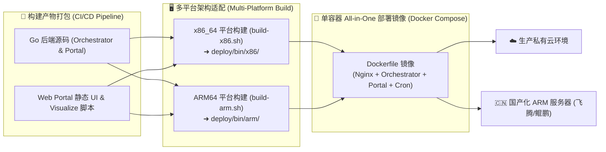

# 【代码知识】统一平台系统架构设计图 (汇报专版)

> **设计核心理念**：全自动化抽取、零本地安装、统一云端服务（看 Wiki · 看图谱 · 问知识）。系统采用双部署单元 (Dual-Unit Architecture) 配合单容器 All-in-One 镜像，具备高可用、易部署与国产化多架构支持能力。

---

## 📐 1. 整体系统架构图 (System Architecture Diagram)

```mermaid
flowchart TD
    %% 样式定义
    classDef client fill:#E5F4FF,stroke:#1A6FB5,stroke-width:2px,color:#030710
    classDef proxy fill:#F2FAFF,stroke:#7FC8FF,stroke-width:2px,color:#030710
    classDef unit2 fill:#FFF3E0,stroke:#E65100,stroke-width:2px,color:#030710
    classDef unit1 fill:#E8F5E9,stroke:#2E7D32,stroke-width:2px,color:#030710
    classDef storage fill:#EDE7F6,stroke:#512DA8,stroke-width:2px,color:#030710
    classDef agent fill:#FFFDE7,stroke:#F57F17,stroke-width:2px,color:#030710

    %% 1. 用户接入层
    subgraph Layer1["🌐 1. 用户接入与终端层 (Client Layer)"]
        Browser["💻 研发/业务人员 浏览器 (Chrome/Edge/Safari)"]
        UI_Portal["📖 统一 Web Portal 界面<br/>(/portal/index.html)"]
        UI_Visualizer["🕸️ 3D 知识图谱 & Wiki 阅读器<br/>(/wiki/repo/index.html)"]
        UI_QA["💬 AI 代码知识问答抽屉<br/>(Stream QA Drawer)"]
    end

    %% 2. 统一网关与代理托管层
    subgraph Layer2["🚀 2. 统一接入网关层 (Nginx Reverse Proxy - 80端口)"]
        Nginx["🛡️ Nginx 统一反向代理网关"]
        Route1["/portal/ ➔ 门户静态资源 & API"]
        Route2["/wiki/ ➔ 静态 Wiki 网页托管 (Alias)"]
        Route3["/api/ ➔ 任务与控制流代理"]
        Route4["/qa/ ➔ AI 流式问答 SSE 代理"]
    end

    %% 3. 双部署单元后端层
    subgraph Layer3["⚙️ 3. 双部署单元服务层 (Dual-Unit Core Backend)"]
        
        %% Unit 2: Web 门户与鉴权服务
        subgraph Unit2["单元 2: Web Portal 门户与鉴权服务 (Go - 8080端口)"]
            AuthMod["🔐 统一认证与 RBAC 模块<br/>(LDAP / Mock Auth)"]
            RepoMgr["📁 仓库注册与权限映射表"]
            BuildTrigger["🚀 构建触发与日志监视器"]
            SessionStore["🔑 Session / Token 会话管理"]
        end

        %% Unit 1: 调度与 AI 知识构建服务
        subgraph Unit1["单元 1: Orchestrator 调度与 AI 知识引擎 (Go - 3000端口)"]
            CronScheduler["⏱️ Git 定时同步与构建调度器 (Cron)"]
            BuilderEngine["⚙️ 静态 Wiki & 图谱导出引擎 (Builder)"]
            QAService["🧠 知识问答与流式推理服务 (QA Stream Engine)"]
        end
    end

    %% 4. AI 多 Agent 核心解析引擎
    subgraph Layer4["🤖 4. AI 多 Agent 知识提取工作流 (DeepAgents Pipeline)"]
        CodeParser["🔍 代码结构与依赖解析器"]
        SkeletonCritic["📐 架构大纲审查 Agent (Skeleton Critic)"]
        WikiQA_Verify["✅ 知识准确性校验 Agent (Wiki-QA)"]
        GraphExporter["📊 3D/2D 知识图谱导出组件 (graph.json)"]
    end

    %% 5. 持久化数据与存储层
    subgraph Layer5["💾 5. 持久化数据与存储层 (Data & Asset Storage)"]
        DB_Portal[("SQLite: portal.db<br/>(用户/Session/仓库表)")]
        DB_Orch[("SQLite: orchestrator.db<br/>(构建记录/定时任务)")]
        GitRepos[("📂 Git 代码仓库缓存<br/>(/data/openwiki/repos)")]
        StaticAssets[("📦 静态 Wiki 知识资产库<br/>(/data/openwiki/static)")]
    end

    %% 数据与控制流连接
    Browser --> UI_Portal & UI_Visualizer & UI_QA
    UI_Portal & UI_Visualizer & UI_QA --> Nginx

    Nginx --> Route1 & Route2 & Route3 & Route4
    Route1 & Route3 --> Unit2
    Route4 --> QAService
    Route2 --> StaticAssets

    Unit2 --> AuthMod & RepoMgr & BuildTrigger & SessionStore
    AuthMod --> DB_Portal
    BuildTrigger -- "HTTP /api/build/trigger" --> CronScheduler

    CronScheduler --> BuilderEngine
    BuilderEngine --> GitRepos
    BuilderEngine --> Layer4
    Layer4 --> GraphExporter
    GraphExporter --> StaticAssets
    BuilderEngine --> DB_Orch
🏛️ 2. 系统核心架
    QAService --> StaticAssets

    %% 绑定样式
    class UI_Portal,UI_Visualizer,UI_QA client
    class Nginx,Route1,Route2,Route3,Route4 proxy
    class AuthMod,RepoMgr,BuildTrigger,SessionStore unit2
    class CronScheduler,BuilderEngine,QAService unit1
    class CodeParser,SkeletonCritic,WikiQA_Verify,GraphExporter agent
    class DB_Portal,DB_Orch,GitRepos,StaticAssets storage
```

---

## 🏛️ 2. 系统核心架构分层说明 (Architectural Highlights)

| 架构分层 | 核心模块 | 职责与技术实现说明 | 汇报价值点 |
| :--- | :--- | :--- | :--- |
| **用户接入层** | 统一 Web Portal / 3D 知识图谱阅读器 | 基于 HTML5/JS/Canvas 实现，零本地安装，浏览器直接看 Wiki、看图谱、问知识。 | **零门槛推广**：研发/业务全员登录即用，无需安装任何客户端。 |
| **网关代理层** | Nginx 统一反向代理 (80端口) | 负责 HTTP/SSE 请求分发、静态 `static/` 资产强缓存控制与端口隔离防护。 | **高性能 & 强安全**：生产级流量托管，防止直接暴露微服务端口。 |
| **单元 2 (Portal)** | Web 门户与鉴权服务 (Go) | 负责企业 LDAP 登录认证、RBAC 角色鉴权、仓库列表管理与构建日志联动。 | **安全管控**：无缝对接行内统一身份认证体系，确保敏感代码安全。 |
| **单元 1 (Orchestrator)**| 调度与 AI 知识引擎 (Go) | 负责 Git 代码定时 Pull、调度 AI 提炼流水线、生成 `graph.json` 并响应 AI 问答。 | **极速自动化**：代码变动自动捕捉，Wiki 与依赖图谱秒级增量更新。 |
| **AI 多 Agent 层** | DeepAgents 协作工作流 | 内置 `Skeleton Critic`（架构大纲审查）与 `Wiki-QA`（双重准确性验证）子 Agent。 | **高质量知识**：解决大模型幻觉问题，确保生成的代码知识准确有据。 |
| **数据存储层** | 有状态挂载卷 (`/data/openwiki`) | 包含轻量 SQLite 数据库（Portal & Orchestrator）、Git 代码缓存及静态 Wiki 库。 | **轻量易运维**：极简数据挂载，方便备份与跨环境平滑迁移。 |

---

## 📦 3. 部署运维与国产化兼容架构 (Deployment & Multi-Arch Architecture)



---

## 💡 4. 汇报演讲要点话术 (Presentation Talking Points)

1. **架构高可用性**：  
   “系统采用了 **微服务双部署单元 (Dual-Unit)** 设计，Portal 前端门户与 Orchestrator 后台 AI 引擎解耦，前端页面访问与后台代码抽取互不干扰，保证高可用性。”

2. **部署极简性**：  
   “采用 **All-in-One 单容器打包** 策略，整合了 Nginx 网关、Go 后端微服务与本地 SQLite 数据库，一键执行 `docker-compose up -d` 即可在内网迅速落地。”

3. **信创与国产化全兼容**：  
   “专为内网和信创环境设计，支持全离线 Vendor 依赖部署，并同时提供 **x86_64 与 ARM64** 双架构打包构建脚本，可无缝部署在鲲鹏、飞腾等国产化操作系统与硬件平台上。”
