# OpenWiki 双部署单元整体测试计划与方案 v2 (审核补充版)

---

## 〇、审核发现与补充说明

> [!IMPORTANT]
> 经过对 v1 版测试方案与实际源码的逐行交叉审核，发现以下 **7 类系统性遗漏**，已在本版全部补充：

| 遗漏类别 | 具体说明 | 影响评级 |
| :--- | :--- | :--- |
| **① 异常路径与错误恢复** | 原方案仅覆盖 Happy Path，缺少 Git 仓库不存在/网络断连、OpenWiki CLI 不可用、Node.js 缺失等故障场景 | 🔴 严重 |
| **② API 输入校验与边界条件** | 缺少空 Body、畸形 JSON、重复 ID 注册、非法 Cron 表达式、路径遍历攻击等边界测试 | 🔴 严重 |
| **③ 数据一致性与竞态** | 缺少同一仓库并发构建互斥、SQLite WAL 并发写入安全性、Build 状态机流转正确性验证 | 🟡 中等 |
| **④ 优雅停机与进程生命周期** | 缺少 SIGTERM 信号处理、构建中途服务重启、子进程孤儿回收等运维稳定性测试 | 🟡 中等 |
| **⑤ 前端 UI 与浏览器兼容性** | 完全缺少前端交互测试（登录流程、抽屉开关、XSS 防护、空状态展示、键盘快捷键） | 🟡 中等 |
| **⑥ 配置容错与环境变量覆盖** | 缺少 config.yaml 不存在时的默认值回退、环境变量覆盖优先级、非法配置值处理 | 🟡 中等 |
| **⑦ 可观测性与运维诊断** | 缺少日志格式校验、Health Check 可用性、构建历史查询分页、错误信息脱敏 | 🟢 低 |

---

## 一、测试目标与范围

本测试方案旨在对 **OpenWiki 独立双部署单元**（`openwiki-orchestrator` 调度单元与 `openwiki-portal` 门户单元）进行全方位、事实性、高完备度的测试验证。保证系统在生产环境（尤其是内网物理隔离、企业 AD 域控环境）下的功能正确性、高并发稳定性以及数据隔离安全性。

### 1.1 测试对象范围
1. **部署单元 1 (`openwiki-orchestrator`)**:
   - 仓库配置与状态持久化 (SQLite WAL 模式)
   - Git 远程 Fetch / Commit HEAD 差异检测
   - 自动化 Cron 调度器与手动触发构建
   - OpenWiki CLI `code --update` 增量构建与 `graph.json` 导出
   - 4 大 Vendor 静态库（`force-graph`, `marked`, `dompurify`, `mermaid`）内网离线打包与部署
   - QA 问答子进程 spawn、并发池限流、超时 Kill 与 SSE 打字机流式推流
2. **部署单元 2 (`openwiki-portal`)**:
   - LDAP / Active Directory 域控 Bind 认证与用户属性拉取
   - SQLite 内部 Session Token 签发、过期校验与 HTTP-Only Cookie 注入
   - Nginx 反向代理与静态 Wiki 路径 (`/wiki/:id/`) 映射
   - 路由透传与 API 跨域处理
   - **独立多页面 Web Portal 架构**:
     - `login.html`: 企业 AD 域登录页面与认证逻辑
     - `index.html`: 独立 Wiki 仪表盘与 AI 问答抽屉
     - `admin.html`: 独立仓库运维注册与手动构建触发
     - `history.html`: 独立问答审计与历史日志查询
     - `js/auth.js`: 页面路由鉴权守卫与全局 Session 管理
     - `js/api.js`: 统一 API 交互与 SSE 流式输出组件
3. **部署架构与集成 (Nginx + Compose)**:
   - 全链路 Nginx 静态文件托管与 API / SSE 流式反向代理
   - 内网离线渲染完备性

---

## 二、测试环境与前置条件

### 2.1 依赖环境配置
| 组件 | 版本/配置要求 | 说明 |
| :--- | :--- | :--- |
| **Go 运行时** | Go 1.22+ | 交叉编译 / 本地原生执行 |
| **Node.js** | Node.js v18+ | 用于执行 OpenWiki 可视化导出脚本 `buildGraph` |
| **Git** | Git 2.35+ | 本地 Git 命令行工具 |
| **OpenWiki CLI** | 最新构建产物 | `openwiki` 环境变量或二进制路径 |
| **LDAP 服务** | AD 域控 / OpenLDAP 或 Mock 服务 | 用于验证 Auth Bind 过程 |
| **Nginx** | Nginx 1.20+ | 反向代理与静态文件托管 |

### 2.2 测试用临时 Git 仓库准备

```bash
# 创建一个最小化的 bare 仓库用于 Git 操作测试
mkdir -p /tmp/test-remote.git && cd /tmp/test-remote.git && git init --bare
mkdir -p /tmp/test-local && cd /tmp/test-local
git clone /tmp/test-remote.git .
echo "initial" > README.md && git add . && git commit -m "init"
git push origin master
```

---

## 三、分层测试策略

```mermaid
flowchart TD
    A["分层测试体系 (v2 增强版)"] --> B["1. 单元测试 Unit Test"]
    A --> C["2. 模块集成测试 Integration Test"]
    A --> D["3. 静态构建与离线渲染测试"]
    A --> E["4. 实时问答与 SSE 流式测试"]
    A --> F["5. 安全与 Session 隔离测试"]
    A --> G["6. 压力与并发池测试"]
    A --> H["7. 异常路径与错误恢复测试 (v2 新增)"]
    A --> I["8. API 边界条件与输入校验 (v2 新增)"]
    A --> J["9. 优雅停机与进程生命周期 (v2 新增)"]
    A --> K["10. 前端 UI 与浏览器交互测试 (v2 新增)"]
    A --> L["11. 配置容错与环境变量覆盖 (v2 新增)"]
    A --> M["12. 数据一致性与状态机测试 (v2 新增)"]
    A --> N["13. 可观测性与运维诊断测试 (v2 新增)"]
```



---

## 四、事实性完备测试用例矩阵 (Test Case Matrix)

### 4.1 单元 1: Orchestrator 核心功能测试

| 用例编号 | 测试模块 | 测试场景 | 输入 / 前置条件 | 预期输出与事实校验标准 |
| :--- | :--- | :--- | :--- | :--- |
| **TC-ORCH-01** | `db` | SQLite 数据库初始化与 WAL 模式迁移 | 路径 `orchestrator.db` 不存在 | 数据库文件自动创建，`repos`, `builds`, `qa_sessions` 表与索引自动建全，SQLite journal_mode 为 `wal` |
| **TC-ORCH-02** | `db` | 仓库 CRUD 操作事实性 | 执行 `SaveRepo`, `GetRepo`, `ListRepos` | 插入一条 repo 记录后，`GetRepo` 返回字段完全匹配，`ListRepos` 包含该 repo |
| **TC-ORCH-03** | `git` | 无更新检测 (No Upstream Changes) | 本地分支与远程 HEAD 一致 | `GitFetchAndDiff` 返回 `HasUpdates = false`，构建日志记录 `skipped` |
| **TC-ORCH-04** | `git` | 存在更新检测 (Upstream Has Updates) | 远程分支推送新 commit | `GitFetchAndDiff` 返回 `HasUpdates = true`，并正确提取 `LocalHead` 与 `RemoteHead` |
| **TC-ORCH-05** | `builder` | OpenWiki 增量构建与 `graph.json` 导出 | 本地代码仓库 + 现有 `wiki_dir` | 1. 成功调用 `openwiki code --update`<br>2. `api/graph` 导出的 JSON 包含节点与边<br>3. 复制 `client.js` 与 `index.html` |
| **TC-ORCH-06** | `builder` | 内网离线 Vendor 资源部署 | 执行 `BuildRepo` | 输出目录下的 `vendor/` 文件夹中必须包含 `force-graph.min.js`, `marked.min.js`, `dompurify.min.js`, `mermaid.min.js` 4 个文件，且大小均 > 0 |
| **TC-ORCH-07** | `qa` | 问答命令行 stdout 捕获与记录 | 调用 `qaRunner.StreamChat` | 标准输出被逐行按 `data: <line>\n\n` SSE 格式输出，完成后 SQLite `qa_sessions` 表新增一条记录 |
| **TC-ORCH-08** | `qa` | 并发限制 (Pool Limit) | 最大并发设置 `maxConcurrent = 2`，同时发起 3 个问答请求 | 前 2 个请求正常执行，第 3 个请求在排队超时后收到 `503` 或 `server busy` 错误，主进程无 Memory / Goroutine 泄漏 |
| **TC-ORCH-09** | `qa` | 命令超时 Kill 机制 | 子进程阻塞执行超过 120s | `context.WithTimeout` 触发，自动 terminate 挂起的 `openwiki` 子进程，不阻塞后续请求 |

---

### 4.2 单元 2: Portal 与认证安全测试

| 用例编号 | 测试模块 | 测试场景 | 输入 / 前置条件 | 预期输出与事实校验标准 |
| :--- | :--- | :--- | :--- | :--- |
| **TC-PORT-01** | `auth` | Mock LDAP 认证验证 | `LDAP_URL=mock` | 任何非空账号密码均返回 `HTTP 200`，`user_id` 与 `display_name` 正确填充 |
| **TC-PORT-02** | `auth` | 真实 AD 域 Bind 失败拒绝 | 错误账号或错误密码 | 返回 `HTTP 401 Unauthorized`，提示 `Authentication failed`，数据库不生成 Session |
| **TC-PORT-03** | `session` | Session Token 自动生成与 Cookie 写入 | 登录成功 | 响应头包含 `Set-Cookie: openwiki_session=<UUID>; Path=/; HttpOnly; SameSite=Lax` |
| **TC-PORT-04** | `session` | 过期 Session 鉴权拦截 | 使用过期或伪造的 Session Token 访问 `/portal/repos` | 返回 `HTTP 401 Unauthorized` |
| **TC-PORT-05** | `api` | 仓库列表 Proxy 与静态路由注入 | 登录用户访问 `GET /portal/repos` | 成功向 Orchestrator 查询列表，并为每个 Repo 插入指向 Nginx 的 `wiki_url: "/wiki/:id/"` |
| **TC-PORT-06** | `api` | 退出登录 (Logout) | 调用 `POST /portal/logout` | SQLite 中删除该 Token，响应头写入 `Set-Cookie: openwiki_session=; Max-Age=-1` |

---

### 4.3 全链路与 Nginx 反向代理测试

| 用例编号 | 测试模块 | 测试场景 | 输入 / 前置条件 | 预期输出与事实校验标准 |
| :--- | :--- | :--- | :--- | :--- |
| **TC-INT-01** | Nginx | 静态 Wiki 页面访问 | 浏览器请求 `http://localhost/wiki/test-repo/` | 正确返回静态 `index.html`，相对路径引用的 `vendor/force-graph.min.js` 等 HTTP 200 加载成功 |
| **TC-INT-02** | Nginx | 离线环境无外网渲染 | 断开节点外网连接 | 浏览器图谱正常渲染，控制台 **零 404** / **零外部 CDN 请求** |
| **TC-INT-03** | Nginx / SSE | 问答 SSE 打字机不卡顿 | 客户端 POST `/api/chat` 请求 | Nginx 设置 `proxy_buffering off` 后，浏览器端收到连续数据流，无全量缓冲积压 |

---

### 4.4 【v2 新增】异常路径与错误恢复测试

> [!WARNING]
> 以下用例专门覆盖**故障注入**场景，验证系统在外部依赖不可用时不崩溃、不挂起、能正确报告错误。

| 用例编号 | 测试模块 | 测试场景 | 输入 / 前置条件 | 预期输出与事实校验标准 |
| :--- | :--- | :--- | :--- | :--- |
| **TC-ERR-01** | `git` | Git 仓库路径不存在 | `local_path` 指向不存在的目录 | `GitFetchAndDiff` 返回非 nil error，`runBuild` 将构建标记为 `failed` 并写入 `builds.error` 字段，**不 panic** |
| **TC-ERR-02** | `git` | Git 远程不可达 (DNS/网络故障) | `git_url` 指向不存在的远程地址 | `git fetch origin` 超时或返回错误，构建记录状态 `failed`，Cron 调度器**继续运行**不退出 |
| **TC-ERR-03** | `builder` | OpenWiki CLI 不存在 (`openwiki` 不在 PATH) | 配置 `openwiki_cli` 为不存在的路径 | `exec.Command` 返回 `exec: "xxx": executable file not found`，`BuildResult.Success = false`，`BuildResult.Error` 包含明确错误信息 |
| **TC-ERR-04** | `builder` | Node.js 不存在 (graph.json 导出失败) | 系统无 `node` 命令 | `exportGraph` 返回错误但被标注为 **Non-fatal**（参见 [builder.go:87](file:///Users/bigc/openwiki/deploy/unit1-orchestrator/internal/scheduler/builder.go#L87)），构建整体仍标记 `success` (仅图谱缺失) |
| **TC-ERR-05** | `builder` | Vendor 目录不存在 | `vendor_assets_dir` 指向空路径 | `copyVendorAssets` 返回 `vendor assets dir not found` 错误，日志记录 `copy vendor assets failed`，**不中断构建** |
| **TC-ERR-06** | `qa` | 子进程启动失败 (openwiki 不存在) | `openwiki_cli` 配置错误 | `cmd.Start()` 返回错误，`StreamChat` 返回 error，API 层返回 HTTP 500 或日志记录错误 |
| **TC-ERR-07** | Portal `api` | Orchestrator 单元 1 宕机时 Portal 仓库查询 | Portal 运行中但 Orchestrator 未启动 | `GET /portal/repos` 返回 `HTTP 502 Bad Gateway`，错误信息 `Failed to connect to Orchestrator`，**不崩溃** |

---

### 4.5 【v2 新增】API 边界条件与输入校验测试

| 用例编号 | 测试模块 | 测试场景 | 输入 / 前置条件 | 预期输出与事实校验标准 |
| :--- | :--- | :--- | :--- | :--- |
| **TC-API-01** | `repos` | 空 Body POST 注册仓库 | `POST /api/repos` Body 为空 | 返回 `HTTP 400 Bad Request`，提示 `Invalid JSON payload` |
| **TC-API-02** | `repos` | 缺少必填字段 | `POST /api/repos {"name":"test"}` (缺少 `id`, `git_url`, `local_path`) | 返回 `HTTP 400`，提示 `id, git_url, and local_path are required` |
| **TC-API-03** | `repos` | 重复 ID 注册 | 先后两次 `POST /api/repos` 使用相同 `id` | 第二次返回 `HTTP 500` (SQLite UNIQUE 约束)，原有记录**不被覆盖** |
| **TC-API-04** | `repos` | 非法 Cron 表达式 | `POST /api/repos {"schedule": "invalid-cron"}` | 仓库入库成功，但 `AddRepoJob` 返回 `invalid cron` 警告日志，Cron 调度器**不崩溃** |
| **TC-API-05** | `chat` | 不存在的 repo_id 问答 | `POST /api/chat {"repo_id":"nonexistent", "question":"test"}` | 返回 `HTTP 404 Not Found`，提示 `Repo not found` |
| **TC-API-06** | `chat` | 缺少 question 字段 | `POST /api/chat {"repo_id":"test-repo"}` | 返回 `HTTP 400`，提示 `repo_id and question are required` |
| **TC-API-07** | `chat` | 缺少 user_id 时默认值 | `POST /api/chat {"repo_id":"test-repo","question":"hello"}` | `user_id` 自动填充为 `"anonymous"`（参见 [chat.go:36](file:///Users/bigc/openwiki/deploy/unit1-orchestrator/internal/api/chat.go#L36)），SQLite 记录中 `user_id = "anonymous"` |
| **TC-API-08** | `build` | GET 构建状态缺少 repo_id | `GET /api/build/status` (无 query 参数) | 返回 `HTTP 400`，提示 `repo_id query parameter is required` |
| **TC-API-09** | `repos` | 方法限制 (PUT/DELETE /api/repos) | `PUT /api/repos` | 返回 `HTTP 405 Method Not Allowed` |
| **TC-API-10** | Portal `login` | 空账号或空密码 | `POST /portal/login {"username":"","password":""}` | 返回 `HTTP 401`，提示 `username and password are required`，**不尝试 LDAP Bind** |

---

### 4.6 【v2 新增】数据一致性与状态机测试

| 用例编号 | 测试模块 | 测试场景 | 输入 / 前置条件 | 预期输出与事实校验标准 |
| :--- | :--- | :--- | :--- | :--- |
| **TC-DATA-01** | `builds` | 构建状态流转完整性 | 执行一次完整 `runBuild` (有更新) | `builds` 表记录状态流转: `running` → `success`/`failed`，`started_at` 和 `finished_at` 均非空 |
| **TC-DATA-02** | `builds` | 无更新时构建记录为 skipped | 执行 `runBuild` (无更新) | `builds` 表新增一条 `status = "skipped"` 记录，`log` 字段包含 `"no updates detected"` |
| **TC-DATA-03** | `qa_sessions` | 问答失败仍记录日志 | `openwiki code chat` 返回非零退出码 | `qa_sessions` 表写入记录，`answer` 字段以 `"Error: "` 前缀开头（参见 [runner.go:87](file:///Users/bigc/openwiki/deploy/unit1-orchestrator/internal/qa/runner.go#L87)） |
| **TC-DATA-04** | `builds` | 构建历史查询分页 | 同一仓库执行 15 次构建 | `GET /api/build/status?repo_id=xxx` 返回最近 10 条记录（`LIMIT 10`），按 ID 倒序排列 |
| **TC-DATA-05** | `sessions` | 过期 Session 清理 | 插入一条 `expires_at` 已过期的 Session | `CleanExpiredSessions()` 执行后该记录被删除，`GetSession` 返回 nil |

---

### 4.7 【v2 新增】优雅停机与进程生命周期测试

| 用例编号 | 测试模块 | 测试场景 | 输入 / 前置条件 | 预期输出与事实校验标准 |
| :--- | :--- | :--- | :--- | :--- |
| **TC-LIFE-01** | `main` | Orchestrator 优雅停机 (SIGTERM) | 服务运行中，发送 `kill -TERM <pid>` | 日志输出 `"Shutting down orchestrator server gracefully..."`，Cron 调度器 Stop，HTTP Server Shutdown 在 10s 内完成 |
| **TC-LIFE-02** | `main` | Portal 优雅停机 (SIGTERM) | 服务运行中，发送 `kill -TERM <pid>` | 日志输出 `"Shutting down portal server gracefully..."`，HTTP 连接排空后退出 |
| **TC-LIFE-03** | `qa` | 问答进行中客户端断开 | SSE 流输出过程中客户端关闭连接 | `r.Context().Done()` 触发，`exec.CommandContext` 自动终止子进程，Goroutine 不泄漏 |

---

### 4.8 【v2 新增】配置容错与环境变量覆盖测试

| 用例编号 | 测试模块 | 测试场景 | 输入 / 前置条件 | 预期输出与事实校验标准 |
| :--- | :--- | :--- | :--- | :--- |
| **TC-CFG-01** | `config` | config.yaml 不存在时默认值回退 | 删除 config.yaml 启动服务 | 服务正常启动，使用默认端口 (Orchestrator `:3000` / Portal `:8080`)，日志输出 `Warning: failed to load config file` |
| **TC-CFG-02** | `config` | 环境变量覆盖 config.yaml | config.yaml 设置 `port: 8080`，同时 `PORTAL_PORT=9090` | 最终监听端口为 `9090`（环境变量优先级高于文件） |
| **TC-CFG-03** | `config` | 环境变量覆盖 LDAP URL | `LDAP_URL=mock` 覆盖 config.yaml 中的真实 LDAP 地址 | LDAP 认证走 Mock 分支，**即使 config.yaml 配置了真实地址** |
| **TC-CFG-04** | `config` | Orchestrator 默认值校验 | 空 config.yaml `{}` | `listen_addr=":3000"`, `openwiki_cli="openwiki"`, `db_path="orchestrator.db"`, `max_concurrent_qa=5`, `qa_timeout_sec=120` |

---

### 4.9 【v2 新增】前端 UI 与浏览器交互测试

> [!NOTE]
> 以下测试需在浏览器中手动执行或通过 Playwright/Selenium 自动化。

| 用例编号 | 测试模块 | 测试场景 | 操作步骤 | 预期输出与事实校验标准 |
| :--- | :--- | :--- | :--- | :--- |
| **TC-UI-01** | Portal 前端 | 未登录时显示登录页面 | 清除 Cookie 后打开 `/portal/` | 显示登录表单，仪表盘隐藏，Header 无用户信息 |
| **TC-UI-02** | Portal 前端 | 登录失败显示错误提示 | 输入错误密码点击登录 | 红色 `alert-error` 提示框显示后端错误信息 |
| **TC-UI-03** | Portal 前端 | 登录成功跳转仪表盘 | Mock 模式输入任意账号密码 | 登录视图隐藏，仪表盘展示，Header 显示用户名与头像首字母 |
| **TC-UI-04** | Portal 前端 | 仓库列表空状态 | 登录后无已注册仓库 | 显示 `"暂无已注册的代码仓库。"` 提示文本 |
| **TC-UI-05** | Portal 前端 | 聊天抽屉开关 | 点击仓库卡片 "💬 AI 问答" 按钮 | 右侧抽屉面板滑出 (`chat-drawer.open` class 添加)，标题显示仓库名 |
| **TC-UI-06** | Portal 前端 | Ctrl+Enter 发送快捷键 | 聊天输入框中按 Ctrl+Enter | 调用 `sendQuestion()`，输入框清空，用户消息气泡出现 |
| **TC-UI-07** | Portal 前端 | XSS 防护 | 仓库名称含 `<script>alert('xss')</script>` | `escapeHTML()` 函数转义输出，页面不执行注入脚本 |
| **TC-UI-08** | Portal 前端 | Wiki 链接正确 | 点击仓库卡片 "📖 查看 Wiki" 按钮 | `<a>` 标签 `href` 值等于 `/wiki/{repo_id}/`，链接在新标签打开 |

---

### 4.10 【v2 新增】安全与攻防测试

| 用例编号 | 测试模块 | 测试场景 | 输入 / 前置条件 | 预期输出与事实校验标准 |
| :--- | :--- | :--- | :--- | :--- |
| **TC-SEC-01** | Portal `session` | 伪造 Session Token | Cookie 设为随机 UUID 串 | `GetSession` 返回 nil (SQLite 无匹配行)，接口返回 `401 Unauthorized` |
| **TC-SEC-02** | Portal `session` | Cookie 属性安全性 | 观察 `Set-Cookie` 响应头 | `HttpOnly=true` (JS 不可读), `SameSite=Lax` (防 CSRF), `Path=/` |
| **TC-SEC-03** | Orchestrator API | `/api/chat` 不鉴权可直接调用 | 无 Session Cookie 直接 POST `/api/chat` | **当前设计**：可直接调用（鉴权由 Nginx 层 Portal 代理保护）。需确认此行为是否符合预期 |
| **TC-SEC-04** | `auth` | LDAP 注入攻击 | `username` 含 `*)(\|` 等 LDAP 特殊字符 | `ldap.EscapeFilter(username)` 正确转义（参见 [ldap.go:60](file:///Users/bigc/openwiki/deploy/unit2-portal/internal/auth/ldap.go#L60)），不产生 LDAP 注入 |
| **TC-SEC-05** | Nginx | 路径遍历攻击 Wiki 目录 | 请求 `GET /wiki/../../../etc/passwd` | Nginx `alias` 配合正则 `^/wiki/([^/]+)/(.*)$` 限制在 `/var/www/openwiki-static/` 下，返回 404 而非泄露系统文件 |

---

### 4.11 【v2 新增】可观测性与运维诊断测试

| 用例编号 | 测试模块 | 测试场景 | 输入 / 前置条件 | 预期输出与事实校验标准 |
| :--- | :--- | :--- | :--- | :--- |
| **TC-OBS-01** | Health Check | Orchestrator 健康检查 | `GET /api/health` | 返回 `HTTP 200`，Body `{"status":"ok","service":"unit1-orchestrator"}` |
| **TC-OBS-02** | Health Check | Portal 健康检查 | `GET /portal/health` | 返回 `HTTP 200`，Body `{"status":"ok","service":"unit2-portal"}` |
| **TC-OBS-03** | CORS | 跨域预检请求 | `OPTIONS /api/repos` | 返回 `HTTP 200`，响应头含 `Access-Control-Allow-Origin: *` |
| **TC-OBS-04** | 日志 | 构建日志完整性 | 执行一次构建流水线 | `builds.log` 字段包含 4 个 Step 标记 (`Step 1` ~ `Step 4`)，每个 Step 有 success/skip/fail 状态 |

---

## 五、自动化测试脚本

### 5.1 Go 单元测试 + 编译验证

```bash
#!/usr/bin/env bash
set -euo pipefail

echo "=== [1/6] 运行单元 1 Go 单元测试 ==="
cd /Users/bigc/openwiki/deploy/unit1-orchestrator
go test -v -race -count=1 ./...

echo "=== [2/6] 运行单元 2 Go 单元测试 ==="
cd /Users/bigc/openwiki/deploy/unit2-portal
go test -v -race -count=1 ./...

echo "=== [3/6] 检查内网 Vendor 离线依赖文件完备性 ==="
VENDOR_DIR="/Users/bigc/openwiki/deploy/unit1-orchestrator/assets/vendor"
mkdir -p "$VENDOR_DIR"
bash /Users/bigc/openwiki/deploy/unit1-orchestrator/scripts/download-vendor.sh "$VENDOR_DIR"
for f in force-graph.min.js marked.min.js dompurify.min.js mermaid.min.js; do
  test -s "$VENDOR_DIR/$f" || { echo "❌ Missing or empty: $f"; exit 1; }
done

echo "=== [4/6] 双单元二进制交叉编译验证 ==="
cd /Users/bigc/openwiki/deploy/unit1-orchestrator && go build -o orchestrator main.go
cd /Users/bigc/openwiki/deploy/unit2-portal && go build -o portal main.go

echo "=== [5/6] 二进制大小校验 (防止空壳) ==="
test $(stat -f%z /Users/bigc/openwiki/deploy/unit1-orchestrator/orchestrator) -gt 1000000 || { echo "❌ orchestrator binary too small"; exit 1; }
test $(stat -f%z /Users/bigc/openwiki/deploy/unit2-portal/portal) -gt 1000000 || { echo "❌ portal binary too small"; exit 1; }

echo "✅ 所有自动化测试与编译构建校验通过！"
```

### 5.2 端到端集成验证 (带服务启动)

```bash
#!/usr/bin/env bash
set -euo pipefail

# 启动服务 (后台)
cd /Users/bigc/openwiki/deploy/unit1-orchestrator
./orchestrator -config config.yaml &
ORCH_PID=$!
sleep 2

cd /Users/bigc/openwiki/deploy/unit2-portal
./portal -config config.yaml &
PORTAL_PID=$!
sleep 2

cleanup() { kill $ORCH_PID $PORTAL_PID 2>/dev/null; }
trap cleanup EXIT

echo "=== TC-OBS-01: Orchestrator Health Check ==="
curl -sf http://127.0.0.1:3000/api/health | grep -q '"status":"ok"' || { echo "❌ FAIL"; exit 1; }
echo "✅ PASS"

echo "=== TC-OBS-02: Portal Health Check ==="
curl -sf http://127.0.0.1:8080/portal/health | grep -q '"status":"ok"' || { echo "❌ FAIL"; exit 1; }
echo "✅ PASS"

echo "=== TC-API-01: Empty Body POST ==="
STATUS=$(curl -s -o /dev/null -w "%{http_code}" -X POST http://127.0.0.1:3000/api/repos)
[ "$STATUS" = "400" ] || { echo "❌ FAIL: expected 400, got $STATUS"; exit 1; }
echo "✅ PASS"

echo "=== TC-API-02: Missing Required Fields ==="
STATUS=$(curl -s -o /dev/null -w "%{http_code}" -X POST http://127.0.0.1:3000/api/repos -H "Content-Type: application/json" -d '{"name":"test"}')
[ "$STATUS" = "400" ] || { echo "❌ FAIL: expected 400, got $STATUS"; exit 1; }
echo "✅ PASS"

echo "=== TC-ORCH-02: Repo CRUD Round-trip ==="
curl -sf -X POST http://127.0.0.1:3000/api/repos -H "Content-Type: application/json" \
  -d '{"id":"e2e-test","name":"E2E Test","git_url":"https://example.com/repo.git","local_path":"/tmp/e2e"}' \
  | grep -q '"id":"e2e-test"' || { echo "❌ FAIL: create"; exit 1; }
curl -sf http://127.0.0.1:3000/api/repos | grep -q '"id":"e2e-test"' || { echo "❌ FAIL: list"; exit 1; }
echo "✅ PASS"

echo "=== TC-API-03: Duplicate ID ==="
STATUS=$(curl -s -o /dev/null -w "%{http_code}" -X POST http://127.0.0.1:3000/api/repos -H "Content-Type: application/json" \
  -d '{"id":"e2e-test","name":"Dup","git_url":"x","local_path":"x"}')
[ "$STATUS" = "500" ] || { echo "❌ FAIL: expected 500, got $STATUS"; exit 1; }
echo "✅ PASS"

echo "=== TC-API-05: Chat with nonexistent repo ==="
STATUS=$(curl -s -o /dev/null -w "%{http_code}" -X POST http://127.0.0.1:3000/api/chat -H "Content-Type: application/json" \
  -d '{"repo_id":"nonexistent","question":"hello"}')
[ "$STATUS" = "404" ] || { echo "❌ FAIL: expected 404, got $STATUS"; exit 1; }
echo "✅ PASS"

echo "=== TC-PORT-01: Mock LDAP Login ==="
BODY=$(curl -sf -X POST http://127.0.0.1:8080/portal/login -H "Content-Type: application/json" \
  -d '{"username":"testuser","password":"pass123"}')
echo "$BODY" | grep -q '"user_id":"testuser"' || { echo "❌ FAIL"; exit 1; }
echo "✅ PASS"

echo "=== TC-PORT-04: Fake Session Token ==="
STATUS=$(curl -s -o /dev/null -w "%{http_code}" -b "openwiki_session=fake-uuid-1234" http://127.0.0.1:8080/portal/repos)
[ "$STATUS" = "401" ] || { echo "❌ FAIL: expected 401, got $STATUS"; exit 1; }
echo "✅ PASS"

echo "=== TC-API-10: Empty Username Login ==="
STATUS=$(curl -s -o /dev/null -w "%{http_code}" -X POST http://127.0.0.1:8080/portal/login -H "Content-Type: application/json" \
  -d '{"username":"","password":""}')
[ "$STATUS" = "401" ] || { echo "❌ FAIL: expected 401, got $STATUS"; exit 1; }
echo "✅ PASS"

echo "=== TC-LIFE-01: Orchestrator Graceful Shutdown ==="
kill -TERM $ORCH_PID
wait $ORCH_PID 2>/dev/null
echo "✅ PASS (process exited cleanly)"

echo ""
echo "🎉 所有端到端集成测试通过！"
```

---

## 六、事实性验收标准 (Definition of Done)

1. **零外网依赖 (Offline Compliant)**：部署在完全隔离的内网物理机上，访问静态 Wiki 图谱不产生任何外部 CDN 报错。
2. **全流程自动化 (Zero-Touch Sync)**：上游代码仓库有 commit 提交后，定时任务自动比对 HEAD 并触发 OpenWiki 增量更新与静态导出。
3. **完备认证隔离 (Auth & Session Secure)**：未登录用户无法访问 `/portal/repos` 与 `/api/chat`，会话过期后自动拦截。
4. **稳定并发防御 (Process Pool Safe)**：高并发问答请求下，并发池有效限流，超期请求自动 Kill 子进程，主进程稳定运行。
5. **异常不崩溃 (Fault Tolerant)** *(v2 新增)*：任何外部依赖（Git/Node/OpenWiki CLI/LDAP）不可用时，服务返回明确错误信息而**不 panic、不挂起**。
6. **输入安全 (Input Safe)** *(v2 新增)*：所有 API 端点拒绝畸形输入、空 Body、缺字段请求，LDAP 查询已做注入防护，Nginx 路径遍历不可利用。
7. **优雅停机 (Graceful Lifecycle)** *(v2 新增)*：SIGTERM 信号发送后 10 秒内完成连接排空与资源释放，不产生孤儿子进程。

---

## 七、测试用例统计

| 测试类别 | v1 原有 | v2 新增 | 合计 |
| :--- | :---: | :---: | :---: |
| Orchestrator 核心功能 | 9 | — | 9 |
| Portal 认证安全 | 6 | — | 6 |
| 全链路集成 | 3 | — | 3 |
| 异常路径与错误恢复 | — | 7 | 7 |
| API 边界条件与输入校验 | — | 10 | 10 |
| 数据一致性与状态机 | — | 5 | 5 |
| 优雅停机与进程生命周期 | — | 3 | 3 |
| 配置容错与环境变量覆盖 | — | 4 | 4 |
| 前端 UI 与浏览器交互 | — | 8 | 8 |
| 安全与攻防 | — | 5 | 5 |
| 可观测性与运维诊断 | — | 4 | 4 |
| **合计** | **18** | **46** | **64** |
