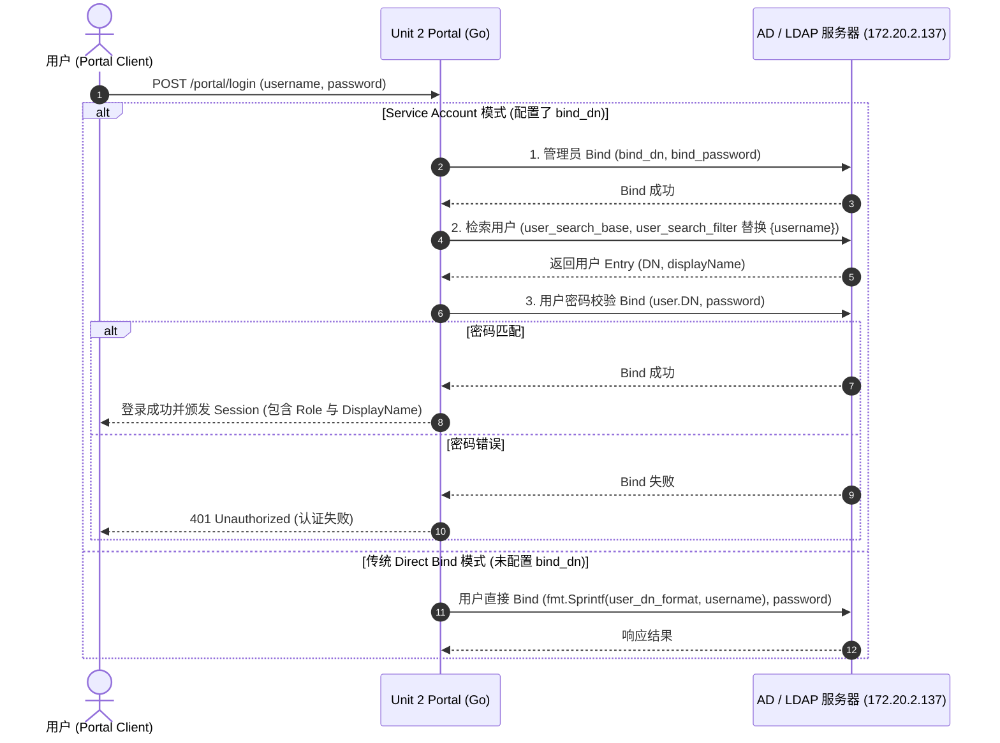

# 接入企业标准 LDAP / AD 认证机制实施计划

根据您提供的生产环境 LDAP 配置规范（包含 Service Account 绑定 `bindDn`/`bindPassword`、`userSearchBase`、`userSearchFilter` 等字段），我们将对 `unit2-portal` 鉴权模块进行升级，使其完全兼容该配置规范，并实现更标准、安全的企业级 LDAP 认证流程。

## 认证流程设计



---

## 拟修改文件列表

---

### [MODIFY] [config.go](file:///Users/bigc/openwiki/deploy/unit2-portal/internal/config/config.go)

扩展 `LDAP` 结构体，添加对企业级 LDAP 配置项的支持（包含别名与 JSON 对应的字段）：

- `Enabled` (`enabled`)：是否启用 LDAP
- `ServerURI` (`server_uri` / `url`)：服务器连接地址（如 `ldap://172.20.2.137:389`）
- `UserSearchBase` (`user_search_base` / `base_dn`)：搜索根 OU（如 `OU=中信百信银行,DC=oa,DC=bx`）
- `UserSearchFilter` (`user_search_filter`)：用户查询过滤器（如 `(&(objectCategory=person)(objectClass=user)(|(userPrincipalName={username})(sAMAccountName={username})))`）
- `BindDN` (`bind_dn`)：管理员账号（如 `baixin_coder@oa.bx`）
- `BindPassword` (`bind_password`)：管理员密码（如 `8dErNZ8@`）
- `DisplayNameAttribute` (`display_name_attribute`)：显示名称属性名（如 `displayName` 或 `cn`）

并在 `overrideEnv` 中添加对应环境变量覆盖逻辑（例如 `LDAP_BIND_DN`、`LDAP_BIND_PASSWORD` 等）。

---

### [MODIFY] [ldap.go](file:///Users/bigc/openwiki/deploy/unit2-portal/internal/auth/ldap.go)

重构 `Authenticate` 函数逻辑：
1. **连接建立**：支持 `server_uri` 或 `url` 参数连接 LDAP。
2. **管理员绑定与搜索 (Admin Search)**：
   - 若配置了 `bind_dn` 与 `bind_password`，先使用管理员凭据与 LDAP 建立 Bind。
   - 使用 `UserSearchBase` 与 `UserSearchFilter`（替换 `{username}`）安全检索用户。
   - 提取用户的真正 Entry DN 及 `displayName`。
3. **用户凭据校验 (User Verification)**：
   - 针对找到的用户 DN 执行二次 Bind 校验用户输入的 `password`。
4. **向下兼容 (Fallback)**：
   - 若未配置 `bind_dn`，退回原有的 `user_dn_format` 直连 Bind 逻辑。

---

### [MODIFY] [config.yaml](file:///Users/bigc/openwiki/deploy/unit2-portal/config.yaml)

更新默认的配置文件，写入生产环境提供的实际配置结构（默认填入生产环境样本或测试环境配置）。

```yaml
ldap:
  enabled: true
  url: "ldap://172.20.2.137:389"
  bind_dn: "baixin_coder@oa.bx"
  bind_password: "8dErNZ8@"
  base_dn: "OU=中信百信银行,DC=oa,DC=bx"
  user_search_filter: "(&(objectCategory=person)(objectClass=user)(|(userPrincipalName={username})(sAMAccountName={username})))"
  display_name_attribute: "displayName"
```

---

### [MODIFY] [ldap_test.go](file:///Users/bigc/openwiki/deploy/unit2-portal/internal/auth/ldap_test.go)

更新单测，确保 Mock LDAP 逻辑不受影响，增加针对 `user_search_filter` 的单测用例覆盖。

---

## 验证计划

### 1. 自动化单元测试
在 `deploy/unit2-portal` 目录下运行：
```bash
go test -v ./internal/auth/...
go test -v ./internal/config/...
```
验证 Mock LDAP 及 配置加载逻辑正确。

### 2. 模拟/环境功能验证
启动 Portal 服务验证配置解析与系统兼容性：
```bash
cd deploy/unit2-portal
go run main.go
```
并通过 curl 验证登录接口及日志是否有 LDAP 异常抛出。
